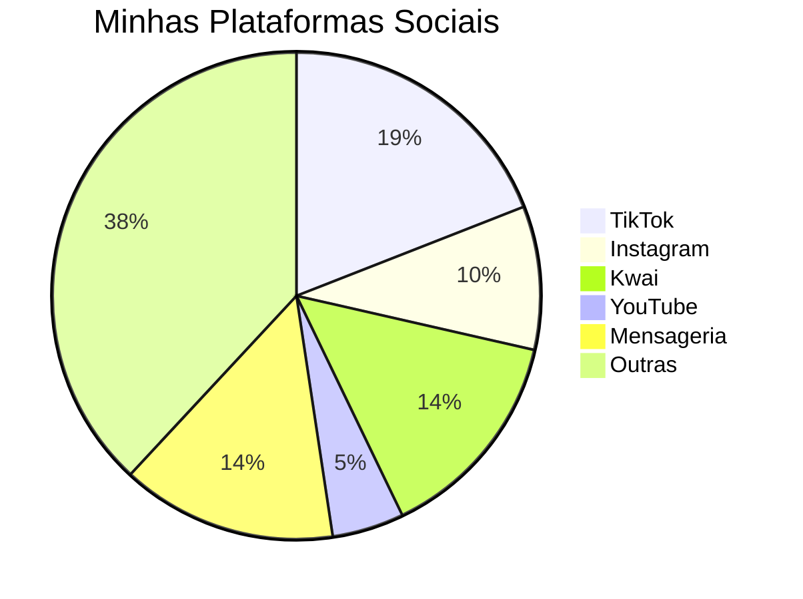

# 🔮 Alexia Melusine - Portal de Redes Sociais

<div align="center">

%20(3)%20(1).png)

### ✨ Trabalho Espiritual & Pombagira ✨

**Orientação espiritual focada em Pombagira, compartilhando conhecimentos sobre espiritualidade, simbologia e empoderamento feminino na religiosidade afro-brasileira.**

---

[](https://www.tiktok.com/@alexia.melusine)
[](https://www.youtube.com/@almasdepombagira)
[](https://www.instagram.com/almasdepombagira/)
[](https://discord.gg/gWZP8R7Dqu)

📧 **Email:** almasdepombagiras@gmail.com

</div>

---

## 📊 Distribuição das Redes Sociais



---

## 🌐 Todas as Minhas Redes Sociais

### 🎵 TikTok
- 🔥 [**TikTok Principal**](https://www.tiktok.com/@alexia.melusine) - @alexia.melusine
- 🪞 [**TikTok Espelhos**](https://www.tiktok.com/@espelhosdepombagira?lang=pt-BR) - @espelhosdepombagira
- 👻 [**TikTok Almas**](https://www.tiktok.com/@almasdepombagira?lang=pt-BR) - @almasdepombagira
- 🌹 [**TikTok Alexia Rosa**](https://www.tiktok.com/@alexiarosadefogo?lang=pt-BR) - @alexiarosadefogo

### 📹 Vídeo & Streaming
- ▶️ [**YouTube**](https://www.youtube.com/@almasdepombagira) - Almas de Pombagira
- 🎬 [**Kwai Almas**](https://www.kwai.com/@AlmasdePombagira) - @AlmasdePombagira
- 🎥 [**Kwai Alexia**](https://www.kwai.com/@AlexiaRosadeFogo) - @AlexiaRosadeFogo
- 📺 [**Kwai Espelhos**](https://www.kwai.com/@espelhosdepombagira) - @espelhosdepombagira

### 📸 Instagram & Threads
- 💜 [**Instagram Almas**](https://www.instagram.com/almasdepombagira/) - @almasdepombagira
- 🌺 [**Instagram Alexia**](https://www.instagram.com/alexiamelusine/) - @alexiamelusine
- 🧵 [**Threads**](https://www.threads.com/@almasdepombagira) - @almasdepombagira

### 💬 Mensageria & Comunidades
- 💎 [**Discord**](https://discord.gg/gWZP8R7Dqu) - Comunidade Exclusiva
- 📱 [**Telegram**](https://t.me/pomba_giras) - Canal Pomba Giras
- 💚 [**WhatsApp**](https://whatsapp.com/channel/0029VbBs2AnJkK7J9J0nLr2G) - Canal Oficial

### 🌟 Outras Plataformas
- 🔵 [**Facebook**](https://www.facebook.com/alexia.tsan.7) - Alexia Tsan
- ☁️ [**Bluesky**](https://bsky.app/profile/almasdepombagira.bsky.social) - @almasdepombagira
- 🤖 [**Meta AI**](https://www.meta.ai/@alexiamelusine) - @alexiamelusine
- 🎨 [**Sora ChatGPT**](https://sora.chatgpt.com/profile/alexialuzdeferro) - @alexialuzdeferro
- 📌 [**Pinterest**](https://br.pinterest.com/almasdepombagira/) - Almas de Pombagira
- 🔴 [**Reddit**](https://www.reddit.com/user/Alexia-Luz-de-Ferro/) - u/Alexia-Luz-de-Ferro
- ⚫ [**Twitter/X**](https://x.com/PambuNjila) - @PambuNjila

---

## 📈 Estatísticas das Plataformas

| Plataforma | Categoria | Status |
|------------|-----------|--------|
| TikTok (4 contas) | Vídeos Curtos | 🟢 Ativo |
| Instagram (2 contas) | Fotos & Stories | 🟢 Ativo |
| YouTube | Vídeos Longos | 🟢 Ativo |
| Kwai (3 contas) | Vídeos Curtos | 🟢 Ativo |
| Discord | Comunidade | 🟢 Ativo |
| Telegram | Canal | 🟢 Ativo |
| WhatsApp | Canal | 🟢 Ativo |
| Outras (7) | Diversas | 🟢 Ativo |

---

## 🎨 Sobre o Projeto

Este é um portal centralizado criado com HTML, CSS e JavaScript puro, apresentando todas as minhas redes sociais em um design moderno com efeito glassmorphism e animações interativas.

### ✨ Características

- 🌈 **Design Glassmorphism** - Interface moderna com efeito de vidro fosco
- 🎭 **Animações Interativas** - Chuva de ícones e efeitos hover
- 📱 **Totalmente Responsivo** - Funciona perfeitamente em todos os dispositivos
- 🎨 **Gradientes Vibrantes** - Paleta de cores roxo e rosa
- ⚡ **Performance Otimizada** - Código leve e rápido

### 🛠️ Tecnologias Utilizadas

```javascript
const technologies = {
  frontend: ["HTML5", "CSS3", "JavaScript"],
  libraries: ["Font Awesome 6.4.0", "Google Fonts - Montserrat"],
  design: ["Glassmorphism", "CSS Animations", "Responsive Design"]
};
```

---

## 🔥 Como Usar

1. **Clone o repositório**
```bash
git clone https://github.com/pombagiras/melusine.git
```

2. **Abra o arquivo HTML**
```bash
cd melusine
# Abra o index.html no seu navegador
```

3. **Personalize conforme necessário**
- Edite o array `socialNetworks` no JavaScript
- Ajuste as cores no CSS
- Modifique o conteúdo do perfil

---

## 💡 Estrutura do Código

```
📦 Projeto
 ┣ 📜 index.html           # Estrutura principal
 ┣ 🎨 <style>              # Estilos CSS inline
 ┣ ⚙️ <script>             # Lógica JavaScript
 ┗ 🖼️ assets               # Imagens (GitHub)
```

---

## 🌟 Destaques do Design

```css
/* Efeito Glassmorphism */
background: rgba(255, 255, 255, 0.15);
backdrop-filter: blur(15px);
border: 1px solid rgba(255, 255, 255, 0.2);

/* Gradiente Principal */
background: linear-gradient(135deg, #1a1a2e 0%, #16213e 50%, #0f3460 100%);

/* Cores de Destaque */
--primary-color: #9c27b0;    /* Roxo */
--secondary-color: #e91e63;   /* Rosa */
```

---

## 📫 Contato

Para consultas espirituais, orientações ou parcerias:

**📧 Email:** almasdepombagiras@gmail.com

---

<div align="center">

### 🔮 "Compartilho conhecimentos sobre espiritualidade, simbologia e empoderamento feminino na religiosidade afro-brasileira" 🔮

---

**© 2023 Alexia Melusine. Todos os direitos reservados.**

⭐ Se este projeto te ajudou, deixe uma estrela!

</div>
